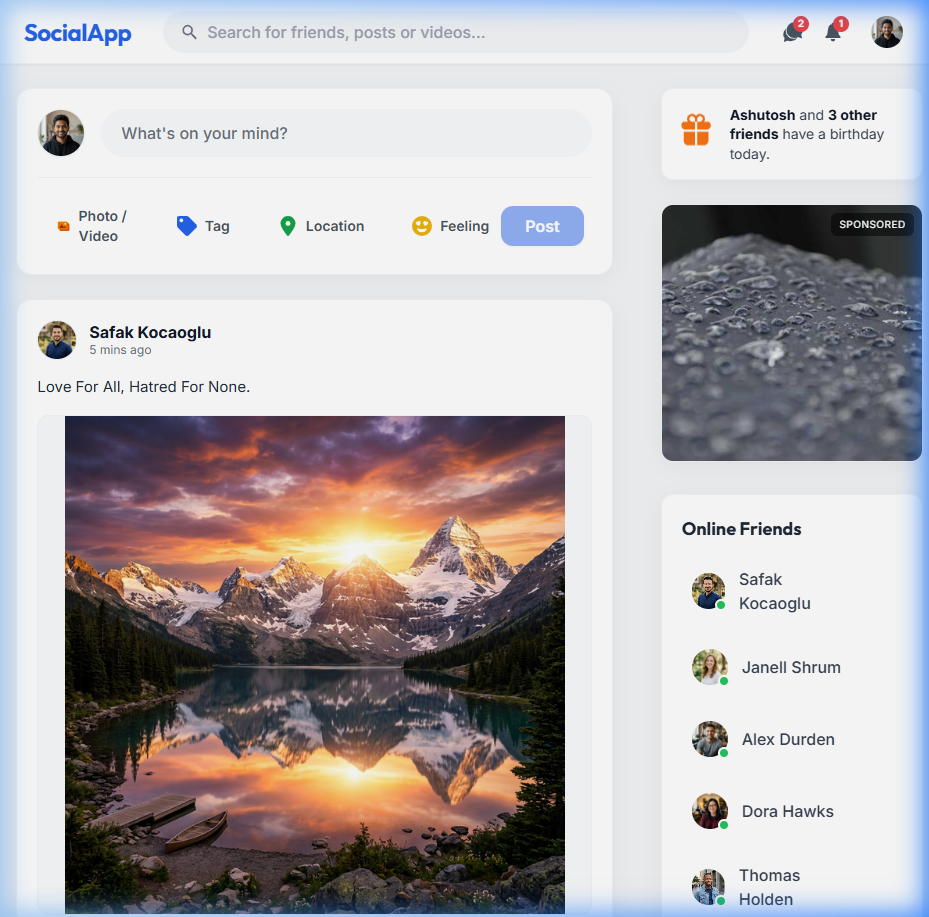
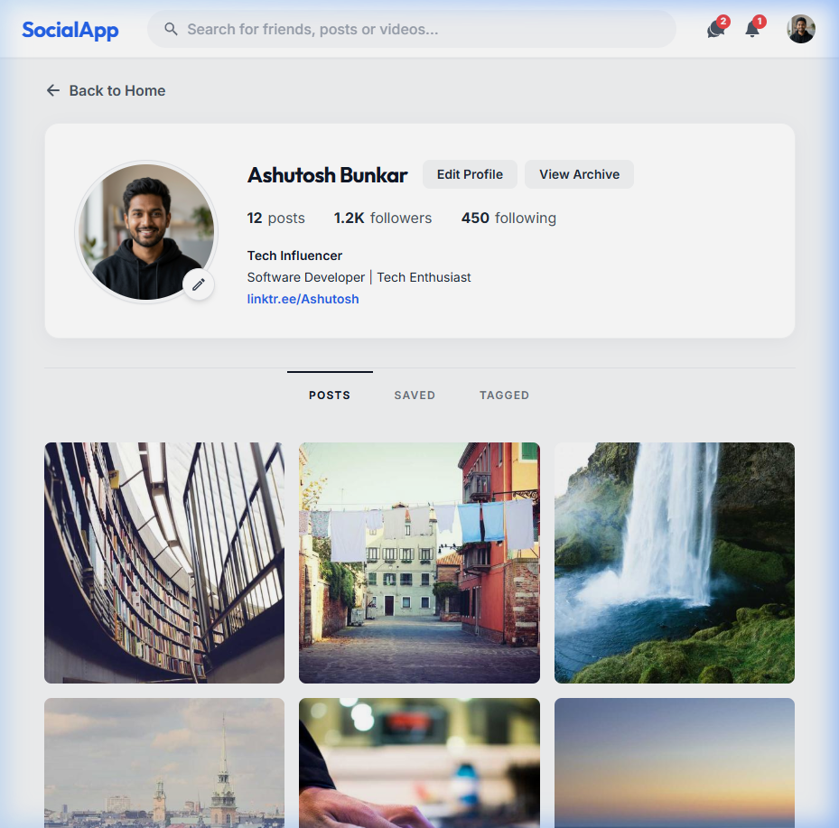

<div align="center">

#  SocialApp

### A Modern, Feature-Rich Social Media Web Application

Built with **React 18** · **Vite** · **Tailwind CSS**

[](https://react.dev/)
[](https://vitejs.dev/)
[](https://tailwindcss.com/)
[](LICENSE)

</div>

---

##  Screenshots

<div align="center">

### Homepage


### Profile Page (Instagram-Inspired)


</div>

---

##  Features

###  Homepage
- **Dynamic Feed** — Create posts with text and image uploads, browse a scrollable feed of content from multiple users.
- **Interactive Posts** — Like (with toggle animation + persisted count), comment (real comments stored and displayed), and share posts.
- **Smart Delete** — Only your own posts show the delete button; other users' posts are protected.
- **Create Post** — Rich post creation box with photo/video upload, tag, location, and feeling options.

###  Profile (Instagram-Inspired)
- **Profile Header** — Avatar, full name, bio, and link displayed in Instagram's signature horizontal layout.
- **Stats Bar** — Posts, Followers, and Following counts prominently displayed.
- **Profile Tabs** — Posts, Saved, and Tagged tab navigation.
- **3-Column Post Grid** — Square-cropped image grid with hover overlays showing likes and comments.
- **Edit Profile** — Modern modal to update name, bio, and profile picture with live preview.

###  Full Persistence
- All data is saved to **localStorage** — posts, likes, comments, and profile changes survive page refreshes.
- Photo uploads are converted to **base64** for reliable persistence without a backend.
- Profile changes (name, bio, avatar) reflect **globally** across the entire app instantly via React Context.

###  Navigation & Interactivity
- **Sticky Header** — Glassmorphism navbar with search bar, message/notification dropdowns, and a profile menu.
- **Sidebar Navigation** — Active route highlighting with React Router integration.
- **Right Sidebar** — Birthday reminders, sponsored ads, and interactive online friends list.
- **Follow/Unfollow** — Toggle follow state on suggested users.

###  Design System
- **Typography** — Google Fonts (Inter + Outfit) for a clean, modern look.
- **Color Palette** — Curated primary blues, soft grays, and white surfaces with consistent tokens.
- **Micro-Animations** — Smooth hover effects, scale transitions, and interactive feedback throughout.
- **Responsive Layout** — Adapts from desktop (3-column) to mobile seamlessly.

---

##  Tech Stack

| Category       | Technology                        |
| -------------- | --------------------------------- |
| **Framework**  | React 18.3                        |
| **Build Tool** | Vite 6.0                          |
| **Styling**    | Tailwind CSS 3.4                  |
| **Routing**    | React Router DOM 7.x              |
| **Icons**      | React Icons 5.x                   |
| **State**      | React Context API + localStorage  |
| **Linting**    | ESLint 9                          |
| **Language**   | JavaScript (ES Modules)           |

---

##  Project Structure

```
Social-Media/
├── public/
│   ├── images/              # Profile pics, post images, ad images
│   └── screenshots/         # App screenshots for README
├── src/
│   ├── Components/
│   │   ├── Feed/            # Feed.jsx, Post.jsx
│   │   ├── Footer/          # Footer.jsx
│   │   ├── Header/          # Header.jsx (navbar)
│   │   ├── Home/            # Home.jsx (main layout)
│   │   ├── Profile/         # Profile.jsx, EditProfile.jsx
│   │   ├── Rightbar/        # Rightbar.jsx, OnlineUser.jsx
│   │   ├── Share/           # Share.jsx (create post)
│   │   └── SIdebar/         # Sidebar.jsx, CloseFriends.jsx
│   ├── Pages/
│   │   ├── Login/           # Login.jsx
│   │   └── Register/        # Register.jsx
│   ├── context/
│   │   └── ProfileContext.jsx   # Global profile state
│   ├── utils/
│   │   └── storage.js       # localStorage helpers
│   ├── App.jsx              # Router & routes
│   ├── dummyData.jsx        # Seed data (users, posts, ads)
│   ├── index.css            # Global styles + scrollbar
│   └── main.jsx             # Entry point
├── tailwind.config.js       # Design tokens & theme
├── package.json
└── vite.config.js
```

---

##  Getting Started

### Prerequisites

- **Node.js** 18+ installed
- **npm** or **yarn**

### Installation

```bash
# Clone the repository
git clone https://github.com/your-username/Social-Media.git
cd Social-Media

# Install dependencies
npm install

# Start the development server
npm run dev
```

The app will be running at **http://localhost:5173**

### Build for Production

```bash
npm run build
npm run preview
```

---

##  Key Architecture Decisions

| Decision | Rationale |
|---|---|
| **localStorage** over a backend | Keeps the project self-contained and deployable as a static site with zero infrastructure. |
| **React Context** for profile | Ensures profile changes (name, avatar) propagate to Header, Feed, Comments, and Share instantly. |
| **Base64 image encoding** | Allows user-uploaded photos to persist in localStorage without needing file storage. |
| **Lifted like/comment state** | Managing likes and comments in `Feed.jsx` (not locally in each `Post`) ensures they persist correctly. |
| **Dynamic comment resolution** | Comments store a `userId`; at render time, the current user's comments always show the latest profile data. |

---

##  Available Scripts

| Script           | Description                         |
| ---------------- | ----------------------------------- |
| `npm run dev`    | Start Vite dev server with HMR      |
| `npm run build`  | Create optimized production build    |
| `npm run preview`| Preview the production build locally |
| `npm run lint`   | Run ESLint checks                   |

---

##  Contributing

Contributions are welcome!
Feel free to open issues and pull requests.

1. Fork the repository
2. Create your feature branch (`git checkout -b feature/amazing-feature`)
3. Commit your changes (`git commit -m 'Add amazing feature'`)
4. Push to the branch (`git push origin feature/amazing-feature`)
5. Open a Pull Request

---

##  License

This project is licensed under the MIT License.

---

<div align="center">

Made with ❤️ by **Ashutosh**


</div>
